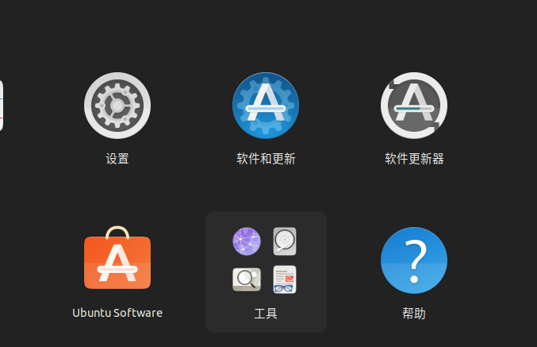
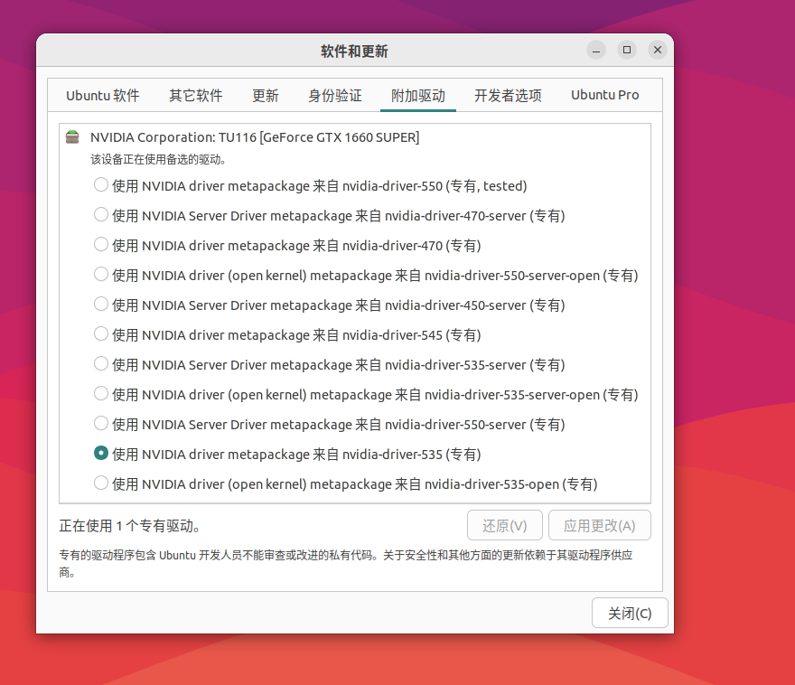
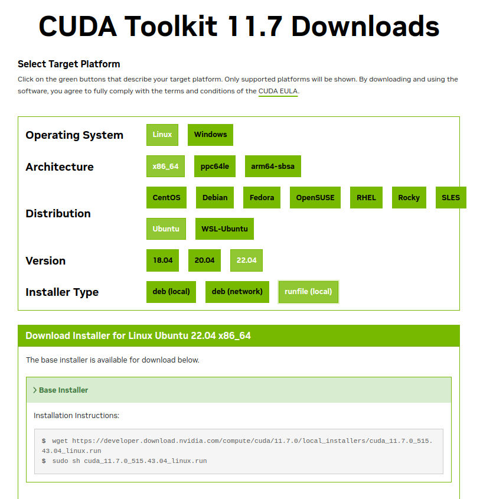
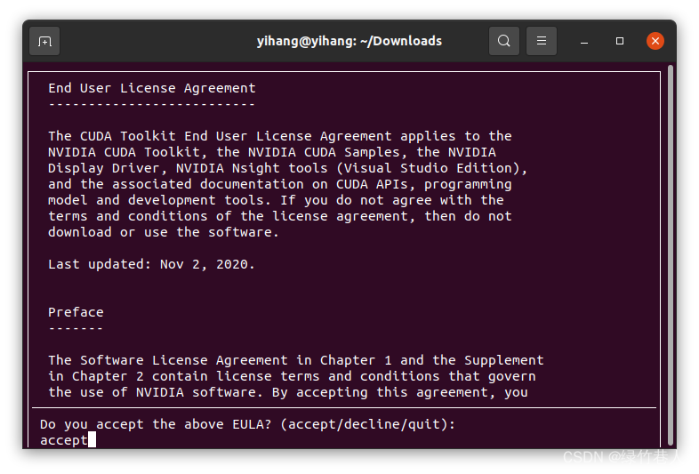
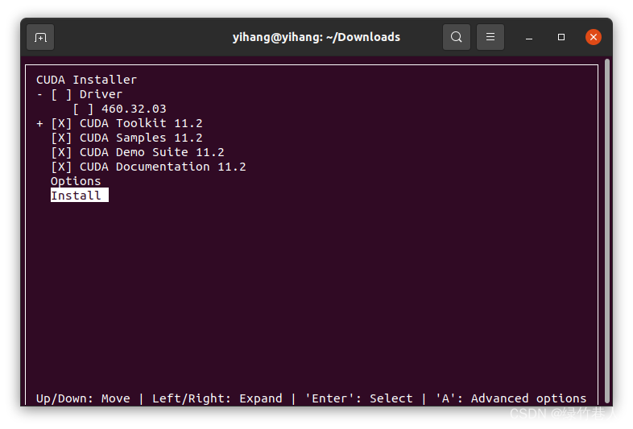
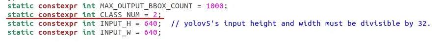

# Automatic Radar Positioning System
> 南京理工大学 Alliance战队 雷达兵种项目文档


``` 
🚨:注意：此仓库为Robomaster比赛的雷达站兵种代码，并非激光雷达相关仓库！！请仔细甄别！！！ 
```

```
🚨ATTENTION: This repo is radar station class code of ROBOMASTER competition, not LiDAR related repo!! Please carefully screen before fork!!
```

``` 🚨:注意：此仓库目前为开发版本，代码并不完全，请先不要部署，否则有很大概率出现项目文件缺失/跑不起来的状况 ```

## 概述

不同于使用较为广泛的PnP方案和双目相机/多相机+激光雷达联合标定方案，我们采用了成本更低，不需要进行测距，更贴近符合人脑思维的定位方式。

我们的大脑能够很容易的根据雷达的二维画面将机器人具体位置自动拟合出来，这是因为我们其实在脑内根据场地的建模进行了一次碰撞检测，而我们又拥有场地的高精度模型，我们何不利用游戏引擎的强大能力模仿这一过程呢？按照这个思路，我们设计出了这一套“歪门邪道”（但在分区赛中标记精度仅次于哈工大三相机+激光雷达）的单目相机+游戏引擎的定位方案。

本项目基于ROS2+Unity实现，代码遵循ROS架构，利用YOLOv5进行机器人图像识别、将识别结果传输至Unity程序进行碰撞检测，并通过串口发送至裁判系统。通过多个节点协同工作，完成从图像处理到位置数据传输的全流程。

由于是初次参与到比赛中，而雷达程序又只有我一个人完成，本程序很多地方都不完善,更多的是希望能提供一些新思路。

2023年雷达站视频开源可参阅我们战队的视频：[RoboMaster2023北部分区赛 南京理工大学 Alliance战队 雷达录像](https://www.bilibili.com/video/BV1LW4y1Q7ab)


## 开发及运行环境：
Ubuntu 22.04 LTS 

ros humble

Unity 2023.3.13f103 

VScode + Devcontainer, 全Docker化开发

## 一些问题
双层神经网络的开销较大(RTX3070 Laptop ~40FPS | RTX 1660S ~ 20FPS)

我们的方案虽然不需要激光雷达，规避了繁琐的解算和标定问题，但受制于相机镜头焦距及相机分辨率，远处装甲板在图像中的特征比较差，即使使用60000张图片数据集训练将近300个epoch，仍然会出现较多识别错误/识别不出来的问题

由于精力有限，程序并没有漂亮的GUI界面，最多利用opencv的imshow函数显示一些debug画面。

Unity作为游戏引擎，功能十分强大，然而Unity中的物理相机毕竟无法完全匹配现实的相机画面，我也没有找到一个较好的方法根据相机画面解出相机在unity世界中的准确位姿，PnP解算出的位置有一定误差，这个误差放在雷达画面上对远处目标精度的影响是毁灭性的。所以，我们只能动用“智能人工”，手动对准相机画面，误差取决于手抖程度（

## 整体架构

项目的整体架构如下：

```
.                 #根目录
radar_ws
├── Dockerfile               # Docker容器构建文件
├── README.md                # 项目说明文档
└── radar_ws                 # ROS2工作空间
    ├── launch.sh               # 启动脚本
    ├── rebuild.sh              # 重新构建脚本
    ├── resources               # 资源文件夹
    │   ├── models               # 模型文件夹 ***                      
    │   │   ├── armor_identfy.engine   # 装甲板识别模型(TensorRT)
    │   │   └── car_identfy.engine     # 车辆识别模型(TenserRT)
    │   ├── user_logs            # 用户日志文件夹
    │   │   ├── detect.log           # 车辆检测日志
    │   │   └── serial.log           # 串口通信日志
    │   ├── videos               # 测试视频文件夹
    │   ├── userlib              # GPU加速相关库
    │   └── config.json          # 项目配置文件 ***
    └── src             # ROS2包源代码目录
        ├── ROS_TCP_Endpoint    # ROS TCP终端节点
        ├── car_detect          # 车辆检测节点
        ├── radar_bringup       # 雷达启动节点
        ├── radar_serial        # 串口通信/小地图显示节点
        ├── ros2_serial         # ROS2串口通信包
        └── serial_util         # 串口工具包(CRC校验等)

```

- **car_detect节点**：负责读取摄像机图像，利用双层YOLOv5网络进行目标识别，分别得到机器人坐标和种类，发送给unity程序。
  
- **unity_raycast程序**：接收car_detect发送的坐标信息，进行碰撞检测获得三维坐标，发送给radar_serial。

- **radar_serial节点**：接收unity程序发送的目标位置信息，将数据通过串口发送至裁判系统。

## 部署方法

克隆本项目，按照DockerFile构建镜像后进入docker容器内

运行脚本进行编译(约20s)
```zsh
cd radar_ws
./rebuild.sh
```

在 ```./radar_ws/resources/models```下放置训练好的模型(命名为```car_identfy.engine```和```armor_identfy.engine```),你可以自定义名称，只需要更改config.json中对应项目即可。

> 关于如何将yolov5训练得到的pt模型转换为tenserRT可用的engine模型见下文


运行节点
```zsh
./launch.sh
```

程序运行日志会输出至```/resources/user_logs```目录下

日志示例:
```
---[ 开始日志 | 时间 2024-04-04 12:33:08 ]---
[2024-04-04 12:33:08] [INFO]: ROS2Message node starting...
[2024-04-04 12:33:08] [INFO]: [√]successfully started.
[2024-04-04 12:33:08] [INFO]: YOLOv5Detector starting...
[2024-04-04 12:33:08] [INFO]: [√]car_detector successfully started.
[2024-04-04 12:33:08] [INFO]: [√]armor_detector successfully started.
[2024-04-04 12:33:08] [INFO]: Loading model...
[2024-04-04 12:33:08] [INFO]: [√]car_detect model loaded.
[2024-04-04 12:33:08] [ERROR]: [x]Error in command_callback: OpenCV(4.5.4) ./modules/dnn/src/onnx/onnx_importer.cpp:739: error: (-2:Unspecified error) in function 'handleNode'
---[ 结束日志 | 时间 2024-04-04 12:33:08 ]---
```
# 配置文件
./radar_ws/resources/config.json
```
{
    "CONF_THRESH": 0.30,        #置信度阈值
    "IOU_THRESHOLD": 0.4,       #IOU阈值
    "LEN_ALL_RESULT": 38001,    #最大识别数量
    "LEN_ONE_RESULT": 38,       #一次最多识别数量
    "VIDEO_STREAM_MODE": "VIDEO",   #模式(VIDEO:视频测试 | CAMERA:正常读取摄像头运行)
    "DETECT_DEBUG": "true",         #是否显示神经网络识别画面(DEBUG选项)
    "SERIAL_DEBUG": "true",         #是否显示小地图(DEBUG选项)
    "FRIEND_SIDE": "BLUE",          #己方颜色
    "publish_topic": "detect_result",   #神经网络识别结果发布的topic name
    "PLUGIN_LIBRARY": "./resources/userlib/libyologpu.so",  #GPU加速相关库文件路径
    "car_engine_file_path": "./resources/models/car_identfy.engine", #模型文件路径
    "armor_engine_file_path": "./resources/models/armor_identfy.engine", #模型文件路径
    "video_path": "./resources/videos/2.mp4", #测试视频文件路径
    "detect_log_path": "./resources/user_logs/detect.log", #神经网络日志文件路径
    "serial_log_path": "./resources/user_logs/serial.log", #串口日志文件路径
    "serial_port": "/dev/ttyUSB0"  #串口USB转TTL模块路径(更改为你的路径)
}
```

---


# 附录*  在Docker内配置TensorRT + GPU环境(将yolov5训练得到的pt模型转换为tenserRT可用的engine模型)
流程：yolo v5 训练模型 --> model.pt --> 利用TensorRTx 转为 .engine
## CUDA + Cudnn + TensorRT 配置
> 此项目GPU加速基于Nvidia显卡，其他品牌显卡请自行搜索配置TensorRT教程，不能保证运行不出错
### Nvidia显卡驱动安装
选择软件和更新


在附加驱动中安装显卡驱动


测试是否安装成功：

输入
```
nvidia-smi
```
如果出现类似以下输出说明安装成功：
```
Fri Apr 12 20:55:28 2024       
+---------------------------------------------------------------------------------------+
| NVIDIA-SMI 535.161.07             Driver Version: 535.161.07   CUDA Version: 12.2     |
|-----------------------------------------+----------------------+----------------------+
| GPU  Name                 Persistence-M | Bus-Id        Disp.A | Volatile Uncorr. ECC |
| Fan  Temp   Perf          Pwr:Usage/Cap |         Memory-Usage | GPU-Util  Compute M. |
|                                         |                      |               MIG M. |
|=========================================+======================+======================|
|   0  NVIDIA GeForce GTX 1660 ...    Off | 00000000:01:00.0  On |                  N/A |
| 40%   35C    P8              10W / 125W |    263MiB /  6144MiB |      2%      Default |
|                                         |                      |                  N/A |
+-----------------------------------------+----------------------+----------------------+
                                                                                         
+---------------------------------------------------------------------------------------+
| Processes:                                                                            |
|  GPU   GI   CI        PID   Type   Process name                            GPU Memory |
|        ID   ID                                                             Usage      |
|=======================================================================================|
|    0   N/A  N/A      1044      G   /usr/lib/xorg/Xorg                          131MiB |
|    0   N/A  N/A      1274      G   /usr/bin/gnome-shell                         58MiB |
|    0   N/A  N/A      7083      G   ...96,262144 --variations-seed-version       34MiB |
|    0   N/A  N/A    103872      G   ...erProcess --variations-seed-version       35MiB |
+---------------------------------------------------------------------------------------+

```
### Docker中使用GPU的配置
#### 安装NVIDIA Container Toolkit
进入官网按步骤安装即可：
[NVIDIA Container Toolkit官网](https://docs.nvidia.com/datacenter/cloud-native/container-toolkit/latest/install-guide.html)
#### 配置Dockerfile和devcontainer.json
在dockerfile最后加入
```
ENV NVIDIA_VISIBLE_DEVICES all
ENV NVIDIA_DRIVER_CAPABILITIES compute,utility
```

Devcontainer.json中加入```"--gpus=all"```

示例
[Devcontainer.json](resources/devcontainer.json)

>注意：这是vscode的devcontainer,若在命令行中运行container,在命令后加上```--gpus=all```参数即可
### CUDA 安装
进入docker内，输入```nvidia-smi```验证驱动是否安装成功

>注意：不同电脑GPU型号不同，请在nvidia-smi处查看你最高支持的cuda版本，自行选择合适版本安装，本文仅作为示例

以cuda11.7 + cudnn8.5为例

按下图选择```runfile```,复制下面两行指令




记得取消勾选安装驱动，然后选择```install```，回车，
接下来就会自动安装了

安装完成后，添加路径:

```
vim ~/.bashrc
```
>如果你用zsh，改成 vim ~/.zshrc

文件最后增加路径(记得改成你的版本)
```
export PATH=/usr/local/cuda-11.7/bin${PATH:+:${PATH}}
export LD_LIBRARY_PATH=/usr/local/cuda-11.7/lib64${LD_LIBRARY_PATH:+:${LD_LIBRARY_PATH}}
```
让路径生效
```
source ~/.bashrc
```
>zsh用 source ~/.zshrc

测试安装是否成功
```
nvcc -V
```
输出应该类似于
```
nvcc: NVIDIA (R) Cuda compiler driver
Copyright (c) 2005-2021 NVIDIA Corporation
Built on Sun_Feb_14_21:12:58_PST_2021
Cuda compilation tools, release 11.7, V11.7.152
Build cuda_11.7.r11.7/compiler.29618528_0
```
### Cudnn安装
[下载链接](https://developer.nvidia.com/cudnn-downloads)

选择和你的cuda版本匹配的cudnn版本(不推荐9.0.0版本！会导致TensorRT版本过高不支持Tensorrtx,
这里我选择8.6.0)


记得选择

```Local Install for Linux x86_64(Tar)```
等待下载完成后原地解压

```
tar -xvf cudnn-linux-x86_64-8.6.0.163_cuda11-archive.tar.gz
```

更改```usr/local/cuda/```文件夹下面的```include```和```lib64```文件夹的权限:
```
cd /usr/local/cuda
sudo chmod 777 include
sudo chmod 777 lib64
```
执行命令复制cudnn的文件进入cuda文件夹(在解压文件夹所在目录执行)
```
sudo cp cudnn-*-archive/include/cudnn*.h /usr/local/cuda/include 
sudo cp cudnn-*-archive/lib/libcudnn* /usr/local/cuda/lib64 
sudo chmod a+r /usr/local/cuda/include/cudnn*.h /usr/local/cuda/lib64/libcudnn*
```
验证是否安装成功，执行命令：
```
sudo cat /usr/local/cuda/include/cudnn_version.h | grep CUDNN_MAJOR -A 2
```
输出应该类似于
```
#define CUDNN_MAJOR 8
#define CUDNN_MINOR 6
#define CUDNN_PATCHLEVEL 0
--
#define CUDNN_VERSION (CUDNN_MAJOR * 1000 + CUDNN_MINOR * 100 + CUDNN_PATCHLEVEL)

/* cannot use constexpr here since this is a C-only file */
```
安装成功

### TensorRT安装
[TensorRT下载网址](https://developer.nvidia.com/nvidia-tensorrt-8x-download)

我的CUDA版本是11.7，因此我要选择TensorRT8.4版本(不推荐10.0版本！会导致TensorRT版本过高不支持Tensorrtx)。在网页中找到对应版本,类似于：

```TensorRT 8.4 GA Update 2 for Linux x86_64 and CUDA 11.0, 11.1, 11.2, 11.3, 11.4, 11.5, 11.6 and 11.7 TAR Package```
这样会下载tar压缩包格式的安装包

解压到你想要的文件夹(你自己记得住就行)

我把TensorRT安装在了```/usr/local```下
```
tar -xzvf TensorRT-8.4.3.1.Linux.x86_64-gnu.cuda-11.6.cudnn8.4.tar.gz -C /usr/local/
```
>若解压出错尝试```tar -xvf```

解压完成后，添加路径:

```
vim ~/.bashrc
```


文件最后增加路径(记得改成你的版本)
```
export LD_LIBRARY_PATH=$LD_LIBRARY_PATH:/usr/local/TensorRT-8.4.3.1/lib
```
让路径生效
```
source ~/.bashrc
```
>zsh用 source ~/.zshrc

测试安装是否成功,编译TensorRT的示例，会在bin路径下生成一个针对MINIST数据集的sample_mnist可执行文件
```
cd /usr/local/TensorRT-8.4.3.1/samples/sampleMNIST
sudo make
cd ../../bin/
./sample_mnist
```
输出应该类似于
```
&&&& RUNNING TensorRT.sample_mnist [TensorRT v8000] # ./sample_mnist
[10/14/2022-17:01:44] [I] Building and running a GPU inference engine for MNIST
[10/14/2022-17:01:44] [I] [TRT] [MemUsageChange] Init CUDA: CPU +146, GPU +0, now: CPU 151, GPU 407 (MiB)
[10/14/2022-17:01:44] [I] [TRT] [MemUsageSnapshot] Builder begin: CPU 153 MiB, GPU 407 MiB
[10/14/2022-17:01:45] [W] [TRT] TensorRT was linked against cuBLAS/cuBLAS LT 11.4.2 but loaded cuBLAS/cuBLAS LT 11.4.1

......
```
为了防止找不到 TensorRT 的库，建议把 TensorRT 的库和头文件链接一下
```
sudo ln -s /usr/local/TensorRT-8.4.3.1/lib/* /usr/lib/
sudo ln -s /usr/local/TensorRT-8.4.3.1/include/* /usr/include/
```
如果要使用 python 版本，则使用 pip 安装，执行下边的指令

```
#TensorRT文件夹下
cd python/
#这里的p37是指python版本为3.7
pip install tensorrt-8.4.3.1-cp37-none-linux_x86_64.whl
```

## Yolov5模型转换
根据你训练模型所用的yolov5版本，```git clone```
yolov5和tensorrtxx

(这里我是yolov5-v7.0和tensorrtx-yolov5-v7.0)

[yolov5-v7.0](http://github.com/ultralytics/yolov5/tree/v7.0)

[tensorrtx-yolov5-v7.0](http://github.com/wang-xinyu/tensorrtx/tree/yolov5-v7.0)

将```/tensorrtx-yolov5-v7.0/yolov5```中的```gen_wts.py```文件拷贝到```yolov5-7.0```目录中，并将模型文件也拷贝到此目录

运行

```
python gen_wts.py -w your_model_name.pt
```
生成```.wts```文件（模型转换的中间文件）

然后进入```/tensorrtx-yolov5-v7.0/yolov5```

修改```src/config.h```文件中的```CLASS_NUM```为你训练的模型的标签类别数

>其他较旧版本:
修改```yololayer.h```文件中的```CLASS_NUM```为你训练的模型的标签类别数



修改```CMakeLists.txt```中的这一段:
```
...

# include and link dirs of cuda and tensorrt, you need adapt them if yours are different
# cuda
include_directories(/usr/local/cuda/include)
link_directories(/usr/local/cuda/lib64)
# tensorrt
# TODO(Call for PR): make TRT path configurable from command line
include_directories(/usr/local/TensorRT-8.4.3.1/include/) #这两行修改为你的路径
link_directories(/usr/local/TensorRT-8.4.3.1/lib/) #这两行修改为你的路径

...
```

然后编译
```
mkdir build
cd build
cmake ..
make
```
生成可执行文件

然后将```.wts```文件拷贝到```build```文件夹中，并执行
```
./yolov5_det -s your_model_name.wts your_model_name.engine s
```
>其他较旧版本:
>```
>./yolov5 -s best.wts best.engine s
>```

生成```.engine```文件，这便是我们tensorrt部署所需要的模型文件


